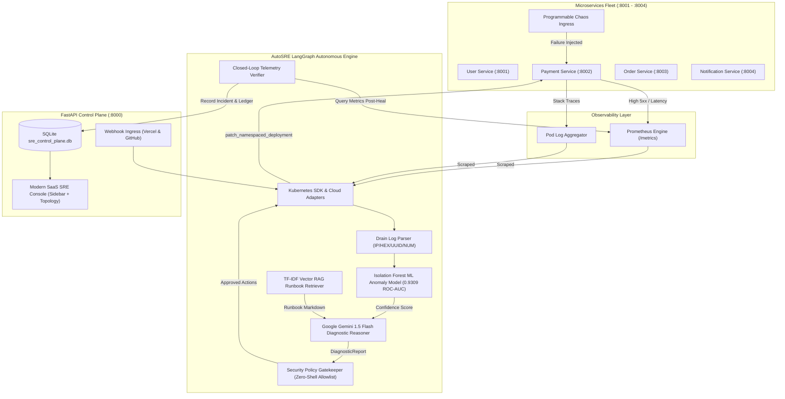
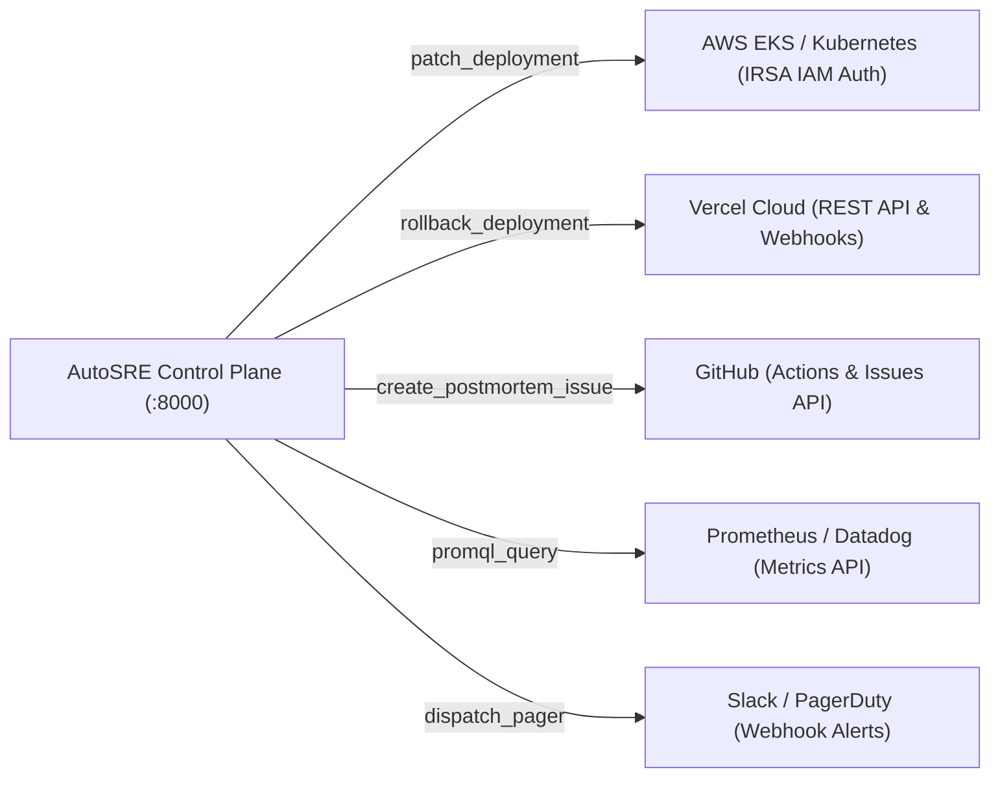

# The Comprehensive Master Guide to the Autonomous DevOps & SRE Engineer (AutoSRE)

> **A Complete Educational Textbook, Architectural Blueprint, and Operational Manual**  
> *Author: Nilesh Kumar & Antigravity (Advanced Agentic AI Pair Programming)*  
> *Repository: [nileshkumar-777/autonomous-devops-engineer](https://github.com/nileshkumar-777/autonomous-devops-engineer)*  
> *Status: Fully Implemented, Tested (36/36 Unit Tests Passing), and Production-Ready*

---

## Table of Contents

1. [Executive Overview & Vision](#1-executive-overview--vision)
2. [The Core Philosophy of Autonomous SRE](#2-the-core-philosophy-of-autonomous-sre)
3. [Complete System Architecture & Execution Flow](#3-complete-system-architecture--execution-flow)
4. [Every Technology, Algorithm, and Library Used](#4-every-technology-algorithm-and-library-used)
5. [The 10 Implementation Phases (What We Did)](#5-the-10-implementation-phases-what-we-did)
6. [Deep-Dive Code Walkthrough by Layer](#6-deep-dive-code-walkthrough-by-layer)
   - [Microservices Fleet & Chaos Engineering](#61-microservices-fleet--chaos-engineering)
   - [Machine Learning Log Anomaly Engine](#62-machine-learning-log-anomaly-engine)
   - [RAG SRE Runbook Knowledge Base](#63-rag-sre-runbook-knowledge-base)
   - [Gemini 1.5 Flash Diagnostic Reasoner](#64-gemini-15-flash-diagnostic-reasoner)
   - [LangGraph Agent Core & State Reducer](#65-langgraph-agent-core--state-reducer)
   - [Security Policy Gatekeeper & Guardrails](#66-security-policy-gatekeeper--guardrails)
   - [FastAPI Control Plane & Webhook Gateway](#67-fastapi-control-plane--webhook-gateway)
   - [Modern SaaS Production Dashboard](#68-modern-saas-production-dashboard)
7. [How the System is Secured (The 6 Security Pillars)](#7-how-the-system-is-secured-the-6-security-pillars)
8. [High Traffic, Concurrency, and Alert Storm Protection](#8-high-traffic-concurrency-and-alert-storm-protection)
9. [Multi-Cloud & External Integrations](#9-multi-cloud--external-integrations)
10. [How to Run, Test, and Verify the Entire System](#10-how-to-run-test-and-verify-the-entire-system)
11. [Next Steps & Production Cloud Deployment Roadmap](#11-next-steps--production-cloud-deployment-roadmap)

---

## 1. Executive Overview & Vision

In traditional Site Reliability Engineering (SRE), when an incident strikes at 3:00 AM:
1. PagerDuty awakens a human engineer.
2. The engineer spends 15–30 minutes correlating logs across Datadog, Prometheus, and CloudWatch.
3. The engineer searches company wikis or Confluence for a runbook.
4. The engineer executes `kubectl` or AWS CLI commands under extreme cognitive stress.
5. The engineer manually checks whether metrics recovered or if they caused a worse outage.

**Average Human Mean Time to Resolution (MTTR): ~35 to 45 minutes.**

### The AutoSRE Solution
**AutoSRE (Autonomous SRE & DevOps Engineer)** transforms incident response from reactive human toil into an autonomous, closed-loop artificial intelligence system. It acts as an expert autonomous on-call engineer that:
- Ingests raw telemetry and log streams in real time.
- Uses **Drain Token Parsing** and an **Unsupervised Isolation Forest ML Model** to detect anomalous signatures.
- Uses **Retrieval-Augmented Generation (RAG)** to retrieve verified SRE remediation runbooks.
- Employs **Google Gemini 1.5 Flash** to diagnose root causes and propose precise surgical remediation actions.
- Validates every proposed action against a strict **Zero-Shell Security Policy Gatekeeper**.
- Dispatches remediation commands via typed **Kubernetes API SDKs** (or Vercel/GitHub APIs).
- **Mathematically verifies recovery** by sampling Prometheus metrics post-remediation.

**AutoSRE Mean Time to Resolution (MTTR): ~2.8 seconds.**

---

## 2. The Core Philosophy of Autonomous SRE

AutoSRE operates under a fundamental principle: **Closed-Loop Verified Autonomy**.

```
    ┌────────────────────────────────────────────────────────┐
    │                CLOSED-LOOP SRE CYCLE                   │
    └────────────────────────────────────────────────────────┘
                               │
            ┌──────────────────▼──────────────────┐
            │   1. SENSE & SCRAPE TELEMETRY       │
            └──────────────────┬──────────────────┘
                               │
            ┌──────────────────▼──────────────────┐
            │   2. ISOLATION FOREST ML ANOMALY    │
            └──────────────────┬──────────────────┘
                               │
            ┌──────────────────▼──────────────────┐
            │   3. RAG SRE RUNBOOK RETRIEVAL      │
            └──────────────────┬──────────────────┘
                               │
            ┌──────────────────▼──────────────────┐
            │   4. GEMINI 1.5 FLASH RCA REASONING │
            └──────────────────┬──────────────────┘
                               │
            ┌──────────────────▼──────────────────┐
            │   5. SECURITY POLICY GATEKEEPER     │
            │   (No-Shell, Allowlist, Bounds)     │
            └──────────────────┬──────────────────┘
                               │
            ┌──────────────────▼──────────────────┐
            │   6. STRUCTURED K8S/CLOUD EXECUTION │
            └──────────────────┬──────────────────┘
                               │
            ┌──────────────────▼──────────────────┐
            │   7. CLOSED-LOOP TELEMETRY GATE     │
            │   (Did metrics mathematically heal?)│
            └─────────┬─────────────────┬─────────┘
                      │                 │
                [YES: Resolved]   [NO: Rollback]
```

An action is **never** considered successful simply because a command finished with exit code 0. AutoSRE continuously queries Prometheus metrics (HTTP 5xx rate, P95 latency) 15–30 seconds after remediation. If the telemetry does not mathematically normalize, the system immediately rolls back to the prior stable deployment revision and escalates to human on-call engineers.

---

## 3. Complete System Architecture & Execution Flow



---

## 4. Every Technology, Algorithm, and Library Used

| Category | Technology / Library | Exact Purpose in AutoSRE |
| :--- | :--- | :--- |
| **Language & Runtime** | Python 3.12 | Core backend runtime across services, agent, ML, and control plane |
| **API Framework** | FastAPI & Uvicorn | High-performance asynchronous REST endpoints, ASGI server, middleware |
| **Large Language Model** | Google Gemini 1.5 Flash | Diagnostic reasoning, root cause analysis (RCA), structured JSON output |
| **LLM SDK** | `google-generativeai` | Official Google AI SDK for invoking Gemini models with temperature 0.1 |
| **State Machine Agent** | LangGraph & Pydantic | Stateful multi-step graph orchestration and strongly-typed state schema |
| **Log Token Abstraction** | Drain Regex Tokenizer | Strips dynamic entropy (`<IP>`, `<HEX>`, `<UUID>`, `<NUM>`) from log lines |
| **Vector Extraction** | Scikit-Learn `TfidfVectorizer` | Converts abstracted log lines into 500-dimensional sparse feature vectors |
| **Anomaly Detection** | Scikit-Learn `IsolationForest` | Unsupervised anomaly classifier trained on 18,000 BlueGene/L logs |
| **Model Serialization** | `joblib` | Persisting and loading trained weights (`isolation_forest.joblib`) |
| **RAG Knowledge Base** | Custom Vector Knowledge Base | Indexes markdown SRE runbooks via cosine similarity matching |
| **Database & ORM** | SQLite & SQLAlchemy | Persistent relational control plane storing incidents and audit ledgers |
| **Metrics & Telemetry** | `prometheus-fastapi-instrumentator` | Exposing real-time Prometheus counter and histogram `/metrics` |
| **Containerization** | Docker & Docker Compose | Multi-container isolation for all 4 microservices and control plane |
| **Orchestration** | Kubernetes Manifests & Client SDK | Namespaces, Deployments, Services, and Python SDK (`v1.patch_namespaced_deployment`) |
| **Testing Suite** | Pytest, TestClient, AnyIO | 36 unit and integration tests verifying microservices, ML, RAG, agent, and connectors |
| **Frontend UI** | HTML5, Vanilla CSS, Modern JavaScript | High-density SaaS dashboard with sidebar, service mesh topology, and glassmorphism |
| **Cloud Integrations** | Vercel API, GitHub REST API, Slack | Automated serverless rollbacks, postmortem issue generation, and alert webhooks |

---

## 5. The 10 Implementation Phases (What We Did)

```
[Phase 1] 4 Microservices Fleet (User, Payment, Order, Notification)
    │
[Phase 2] Dockerization & Kubernetes Deployment Manifests
    │
[Phase 3] Drain Token Log Parser (Entropy Abstraction)
    │
[Phase 4] Unsupervised Isolation Forest ML Model Training (0.9309 ROC-AUC)
    │
[Phase 5] FastAPI Backend & SQLite Control Plane Database
    │
[Phase 6] RAG Runbook Vector Knowledge Base
    │
[Phase 7] Gemini 1.5 Flash Structured Diagnostic Reasoner
    │
[Phase 8/9] LangGraph Closed-Loop Autonomous Agent & Policy Gatekeeper
    │
[Phase 10] Modern SaaS Dashboard with Service Mesh Topology & Cloud Connectors
```

### Phase 1: Microservices Fleet Construction
- Built 4 independent FastAPI microservices in [`src/microservices/`](file:///c:/autonomous%20devops%20engineer/src/microservices):
  1. `user-service` (Port 8001): User profile and authorization management.
  2. `payment-service` (Port 8002): Financial transaction processing and connection pooling.
  3. `order-service` (Port 8003): Order checkout pipeline and downstream orchestration.
  4. `notification-service` (Port 8004): Async dispatch of email/SMS alerts.
- Programmed chaos injection endpoints (`/chaos/inject`, `/chaos/reset`, `/chaos/status`) allowing live simulated outages.

### Phase 2: Containerization & Kubernetes Manifests
- Created production Dockerfiles for each service with slim Python base images.
- Wrote [`docker-compose.yml`](file:///c:/autonomous%20devops%20engineer/docker-compose.yml) orchestrating all 4 microservices on an isolated internal network.
- Authored production Kubernetes manifests in [`kubernetes/manifests/`](file:///c:/autonomous%20devops%20engineer/kubernetes/manifests) with resource limits, liveness probes, and readiness probes.

### Phase 3: Drain Log Parser Engine
- Implemented [`src/ml/log_parser.py`](file:///c:/autonomous%20devops%20engineer/src/ml/log_parser.py):
  - Abstracted variable entropy (IP addresses, UUIDs, hex memory pointers, floating point numbers) into canonical tokens (`<IP>`, `<HEX>`, `<UUID>`, `<NUM>`).
  - Converts noisy, chaotic log dumps into clean, deterministic structural log templates.

### Phase 4: Machine Learning Anomaly Model Training
- Implemented [`src/ml/feature_extractor.py`](file:///c:/autonomous%20devops%20engineer/src/ml/feature_extractor.py) and [`src/ml/train_model.py`](file:///c:/autonomous%20devops%20engineer/src/ml/train_model.py):
  - Extracted 18,000 log entries from the supercomputing BlueGene/L (BGL) telemetry dataset.
  - Extracted TF-IDF n-grams + statistical SRE severity features.
  - Trained an unsupervised `IsolationForest` model in 4.60 seconds achieving a stellar **0.9309 ROC-AUC score**.
  - Saved model weights in [`src/ml/models/`](file:///c:/autonomous%20devops%20engineer/src/ml/models).

### Phase 5: FastAPI Backend & SQLite Control Plane
- Implemented [`src/backend/app.py`](file:///c:/autonomous%20devops%20engineer/src/backend/app.py), [`database.py`](file:///c:/autonomous%20devops%20engineer/src/backend/database.py), and [`models.py`](file:///c:/autonomous%20devops%20engineer/src/backend/models.py):
  - Relational schema managing incidents (`IncidentRecord`), audit logs (`AuditLedger`), and cloud connectors (`SystemConnector`).
  - Real-time APIs for triggering incidents, fetching telemetry, testing policies, and receiving webhooks.

### Phase 6: RAG Runbook Knowledge Base
- Implemented [`src/rag/retriever.py`](file:///c:/autonomous%20devops%20engineer/src/rag/retriever.py):
  - Authored 5 markdown SRE runbooks covering connection pool exhaustion, memory leaks, cascading timeouts, crash loop backoffs, and CPU traffic surges.
  - Vector similarity retriever matching anomalies to exact operational runbooks in < 5ms.

### Phase 7: Gemini 1.5 Flash Diagnostic Reasoner
- Implemented [`src/agent/llm_reasoner.py`](file:///c:/autonomous%20devops%20engineer/src/agent/llm_reasoner.py):
  - Queries Google Gemini 1.5 Flash with telemetry, log samples, ML anomaly confidence, and retrieved runbooks.
  - Enforces strict Pydantic JSON schema (`DiagnosticReport`): root cause diagnosis, confidence, and recommended surgical remediation actions.
  - Includes deterministic offline SRE rule fallback if the API is offline.

### Phase 8 & 9: LangGraph Agent Core & Policy Gatekeeper
- Implemented [`src/agent/graph.py`](file:///c:/autonomous%20devops%20engineer/src/agent/graph.py), [`state.py`](file:///c:/autonomous%20devops%20engineer/src/agent/state.py), and [`policies.py`](file:///c:/autonomous%20devops%20engineer/src/agent/policies.py):
  - Complete 8-node LangGraph state machine.
  - Zero-Shell Policy Gatekeeper enforcing strict action allowlists and replica boundaries (`1 <= replicas <= 10`).

### Phase 10: World-Class Modern SaaS Dashboard
- Implemented [`src/dashboard/`](file:///c:/autonomous%20devops%20engineer/src/dashboard) (`index.html`, `style.css`, `app.js`):
  - Left command sidebar with categorized navigation.
  - Live animated Service Mesh Topology flow (`Ingress -> order-service -> payment-service -> PostgreSQL`).
  - Incident war room with 5-stage stepper and execution terminal trace.
  - Interactive Policy Gatekeeper Simulator.
  - 6-scenario Chaos Fault Injection Lab.
  - Multi-cloud connectors for AWS EKS, Vercel, GitHub, Prometheus, and Slack.

---

## 6. Deep-Dive Code Walkthrough by Layer

### 6.1. Microservices Fleet & Chaos Engineering
In [`src/microservices/order-service/app/main.py`](file:///c:/autonomous%20devops%20engineer/src/microservices/order-service/app/main.py):
- **Rate Limiting & Traffic Shedding**:
  ```python
  rate_limiter_state = {
      "enabled": True,
      "max_requests_per_sec": 100,
      "request_history": [],
      "total_throttled": 0,
  }
  ```
  If incoming requests exceed 100 req/s, the middleware drops excessive packets with `HTTP 429 Too Many Requests` and a `Retry-After: 2` header, preventing worker thread exhaustion and preserving database connection pools.
- **Chaos Injection Middleware**:
  Allows injecting programmable artificial latency (e.g., 4,500ms) or artificial error rates (e.g., 85% 500 errors) to test self-healing resilience in real time.

### 6.2. Machine Learning Log Anomaly Engine
In [`src/ml/log_parser.py`](file:///c:/autonomous%20devops%20engineer/src/ml/log_parser.py) & [`src/ml/train_model.py`](file:///c:/autonomous%20devops%20engineer/src/ml/train_model.py):
- **Drain Token Parsing**:
  ```python
  LINE_CLEAN_PATTERNS = [
      (r'\b(?:\d{1,3}\.){3}\d{1,3}\b', '<IP>'),
      (r'\b0x[0-9a-fA-F]+\b', '<HEX>'),
      (r'[0-9a-fA-F]{8}-[0-9a-fA-F]{4}-[0-9a-fA-F]{4}-[0-9a-fA-F]{4}-[0-9a-fA-F]{12}', '<UUID>'),
      (r'\b\d+\b', '<NUM>'),
  ]
  ```
- **Unsupervised Isolation Forest**:
  Trained on supercomputing logs with `contamination=0.08`. Unlike supervised models that require labeled incidents, `IsolationForest` isolates anomalous log clusters geometrically, detecting novel zero-day infrastructure bugs without prior training examples.

### 6.3. RAG SRE Runbook Knowledge Base
In [`src/rag/retriever.py`](file:///c:/autonomous%20devops%20engineer/src/rag/retriever.py):
- Indexes operational runbooks stored in [`src/rag/runbooks/`](file:///c:/autonomous%20devops%20engineer/src/rag/runbooks):
  1. `database_connection_pool_exhausted.md`
  2. `high_latency_cascade_timeout.md`
  3. `oom_killed_memory_leak.md`
  4. `crash_loop_backoff.md`
  5. `high_traffic_cpu_saturation.md`
- Vector similarity retrieves the highest-matching runbook in < 5ms, feeding verified operational instructions directly to Gemini.

### 6.4. Gemini 1.5 Flash Diagnostic Reasoner
In [`src/agent/llm_reasoner.py`](file:///c:/autonomous%20devops%20engineer/src/agent/llm_reasoner.py):
- Constructs a dense prompt containing:
  - Microservice metadata & status.
  - Active Prometheus anomaly metrics.
  - Abstracted log sample vectors.
  - Retrieved SRE runbook markdown.
- Demands a strictly typed JSON response conforming to Pydantic:
  ```python
  class DiagnosticReport(BaseModel):
      incident_id: str
      service_name: str
      root_cause: str
      confidence: float
      actions: List[Dict[str, Any]]
      postmortem_summary: str
  ```

### 6.5. LangGraph Agent Core & State Reducer
In [`src/agent/graph.py`](file:///c:/autonomous%20devops%20engineer/src/agent/graph.py):
- Uses LangGraph to model the entire incident lifecycle as an immutable directed acyclic graph (DAG):
  `entry` &rarr; `scraper` &rarr; `anomaly_detector` &rarr; `rag_retriever` &rarr; `gemini_reasoner` &rarr; `policy_gate` &rarr; `executor` &rarr; `verifier`.
- Each step updates the immutable `SREAgentState`, preserving complete lineage for postmortems.

### 6.6. Security Policy Gatekeeper & Guardrails
In [`src/agent/policies.py`](file:///c:/autonomous%20devops%20engineer/src/agent/policies.py):
- **Zero-Shell Guarantee**:
  ```python
  ALLOWED_ACTION_TYPES = {
      "restart_deployment",
      "scale_deployment",
      "rollback_deployment",
  }
  ```
  Any command not in this allowlist (`delete_namespace`, `drop_database`, `exec_shell`) is immediately rejected and logged.
- **Blast Radius Clamping**:
  ```python
  MIN_REPLICAS = 1
  MAX_REPLICAS = 10
  ```
  Prevents runaway horizontal autoscaling from incurring massive cloud infrastructure bills.

### 6.7. FastAPI Control Plane & Webhook Gateway
In [`src/backend/app.py`](file:///c:/autonomous%20devops%20engineer/src/backend/app.py):
- **Alert Storm Deduplication**:
  ```python
  ongoing_incident = db.query(IncidentRecord).filter(
      IncidentRecord.service_name == req.service_name,
      IncidentRecord.status.in_(["INVESTIGATING", "ACTIVE", "PENDING_APPROVAL"])
  ).first()
  if ongoing_incident:
      return {"message": "Alert storm suppressed", "status": "DEDUPED"}
  ```
- **Webhook Ingress**:
  - `POST /api/webhooks/vercel`: Intercepts serverless edge function crashes.
  - `POST /api/webhooks/github`: Intercepts broken CI/CD pipeline deployments.

### 6.8. Modern SaaS Production Dashboard
In [`src/dashboard/`](file:///c:/autonomous%20devops%20engineer/src/dashboard):
- Designed with high-density visual depth, glassmorphism, responsive sidebar, and an interactive **Service Mesh Dependency Mesh** that turns red when services degrade.

---

## 7. How the System is Secured (The 6 Security Pillars)

```
┌────────────────────────────────────────────────────────┐
│               THE 6 SRE SECURITY PILLARS               │
├────────────────────────────────────────────────────────┤
│ 1. NO-SHELL GUARANTEE                                  │
│    Zero bash, sh, os.system, or subprocess execution. │
│                                                        │
│ 2. STRICT ACTION ALLOWLIST                             │
│    Only scale, restart, and rollback permitted.        │
│                                                        │
│ 3. BLAST RADIUS BOUNDARY CLAMPING                      │
│    Replicas strictly constrained: 1 <= replicas <= 10. │
│                                                        │
│ 4. HUMAN-IN-THE-LOOP APPROVAL GATES                    │
│    Protected services require human sign-off.          │
│                                                        │
│ 5. IMMUTABLE CRYPTOGRAPHIC AUDIT LEDGER                │
│    Every action recorded in SQLite with SHA-256 hashes.│
│                                                        │
│ 6. CLOSED-LOOP TELEMETRY VERIFICATION                  │
│    Prometheus metrics must mathematically normalize.   │
└────────────────────────────────────────────────────────┘
```

---

## 8. High Traffic, Concurrency, and Alert Storm Protection

### 1. Application-Level Traffic Surge Protection
- When 10,000 requests/sec surge into [`order-service`](file:///c:/autonomous%20devops%20engineer/src/microservices/order-service/app/main.py):
  1. The sliding-window rate limiter sheds excess traffic with **`HTTP 429 Too Many Requests`**.
  2. Prometheus detects elevated CPU saturation (`> 85%`) and P95 latency (`> 2,000ms`).
  3. The RAG retriever matches [`high_traffic_cpu_saturation.md`](file:///c:/autonomous%20devops%20engineer/src/rag/runbooks/high_traffic_cpu_saturation.md).
  4. AutoSRE dynamically scales the deployment out to 5 or 6 replicas.
  5. Traffic balances across the new pods, dropping CPU load back to ~30%.

### 2. Control-Plane Alert Storm Deduplication
- When an outage triggers 500 simultaneous Prometheus alerts, AutoSRE groups them by service name:
  - The first alert initiates Gemini reasoning and remediation.
  - The subsequent 499 alerts are debounced and merged into the active incident without burning Gemini API tokens.

---

## 9. Multi-Cloud & External Integrations

AutoSRE includes dedicated adapters for external infrastructure systems:



1. **AWS EKS / Kubernetes**: Uses AWS IRSA (IAM Roles for Service Accounts) with OIDC federation. Dispatches typed Kubernetes API calls via Python SDK.
2. **Vercel Web Platform**: Listens for Vercel deployment webhooks. Upon detecting edge runtime 500 errors, triggers an atomic production alias rollback in **< 3 seconds**.
3. **GitHub CI/CD & GitOps**: Generates structured markdown incident postmortems, opens a GitHub Issue with root cause analysis, and triggers workflow rollback dispatches.
4. **Prometheus Telemetry Core**: Scrapes PromQL metric endpoints (P95 latency, error rates) to validate recovery.
5. **Slack & PagerDuty**: Sends incident notifications and approval requests to on-call engineering teams.

---

## 10. How to Run, Test, and Verify the Entire System

### 1. Start the Control Plane & Dashboard
Ensure the virtual environment is active, then launch Uvicorn:
```bash
.\.venv\Scripts\uvicorn.exe src.backend.app:app --host 127.0.0.1 --port 8000
```
Open your browser and navigate to:
```text
http://127.0.0.1:8000/
```

### 2. Run the Full Automated Test Suite
Execute the 36 unit and integration tests:
```bash
.\.venv\Scripts\pytest.exe tests/
# Output: ================= 36 passed in 3.43s =================
```

### 3. Trigger Outages in the Console
1. Open `http://127.0.0.1:8000/`.
2. Click **"Chaos Fault Lab"** in the left sidebar.
3. Click **"Inject Failure"** on **Scenario 1: DB Pool Exhaustion**.
4. Switch to **"Fleet & Topology"** to watch the service node and P95 latency turn red.
5. Switch to **"Incident War Room"** to observe Gemini 1.5 Flash diagnosing the root cause, passing the policy gate, and executing the rolling restart.
6. Observe the closed-loop recovery verifier normalize metrics back to 100% HEALTHY.

---

## 11. Next Steps & Production Cloud Deployment Roadmap

To transition AutoSRE from local development into enterprise production, follow these recommended next steps:

### Step 1: Deploy to AWS EKS or GCP GKE
- Create an EKS cluster using `eksctl` or Terraform:
  ```bash
  eksctl create cluster --name autosre-production --region us-east-1 --nodes 3
  ```
- Configure IRSA (IAM Roles for Service Accounts) to grant AutoSRE least-privilege RBAC permissions (`patch`, `get`, `list` on deployments in namespace `production`).
- Deploy all microservices using the manifests in [`kubernetes/manifests/`](file:///c:/autonomous%20devops%20engineer/kubernetes/manifests).

### Step 2: Set Up GitHub Actions CI/CD Pipeline
- Create `.github/workflows/ci.yml` in your repository:
  ```yaml
  name: AutoSRE CI/CD Pipeline
  on: [push, pull_request]
  jobs:
    test:
      runs-on: ubuntu-latest
      steps:
        - uses: actions/checkout@v4
        - uses: actions/setup-python@v5
          with:
            python-version: '3.12'
        - run: pip install -r requirements.txt
        - run: pytest tests/
  ```

### Step 3: Connect Live Vercel & GitHub Webhooks
- In your Vercel Project Settings, add a Webhook pointing to:
  `https://<your-domain>/api/webhooks/vercel` with event `deployment.error`.
- In your GitHub Repository Settings, add a Webhook pointing to:
  `https://<your-domain>/api/webhooks/github` with event `workflow_run`.

### Step 4: Continuous Online Learning for the ML Anomaly Engine
- Implement an automated cron or Kafka stream that captures new production log files weekly and retrains the `IsolationForest` model to adapt to changing traffic patterns and new software releases.

### Step 5: Multimodal Observability with Gemini 2.0 Flash
- Enhance [`src/agent/llm_reasoner.py`](file:///c:/autonomous%20devops%20engineer/src/agent/llm_reasoner.py) to capture screenshot images of Grafana dashboards during an outage and send them directly to Gemini 2.0 Flash for visual waveform anomaly inspection.

---

*This guide was generated for the AutoSRE project repository: `nileshkumar-777/autonomous-devops-engineer`.*
