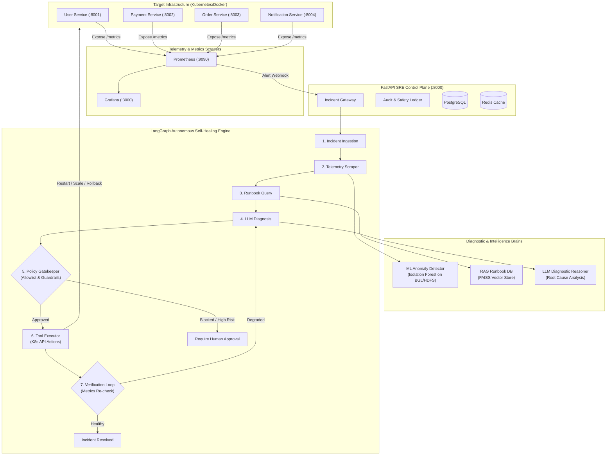

# 🤖 Autonomous DevOps Engineer (AutoSRE)

[](https://www.python.org/downloads/)
[](https://fastapi.tiangolo.com)
[](https://www.docker.com/)
[](https://kubernetes.io/)
[](https://langchain-ai.github.io/langgraph/)
[](LICENSE)

An intelligent, autonomous **Site Reliability Engineering (SRE) & DevOps platform** designed to monitor cloud microservices, detect anomalies, analyze root causes using machine learning and LLMs, formulate remediation plans under safety guardrails, and execute closed-loop self-healing on Kubernetes.

---

## 🏗️ System Architecture



---

## 📁 Repository Structure

```text
autonomous-devops-engineer/
├── README.md                           # Master architectural overview & docs
├── requirements.txt                    # Python workspace dependencies
├── docker-compose.yml                  # Local orchestration for all 4 microservices
├── .gitignore                          # Excludes huge datasets, logs, virtualenv, and secrets
│
├── docs/                               # Architecture blueprints & roadmaps
│   ├── complete_implementation_checklist.md # 10-Phase master implementation checklist
│   └── roadmap-portal/                 # Interactive visual learning & architecture reference
│       ├── index.html
│       ├── style.css
│       └── app_v6.js
│
├── datasets/                           # Benchmark system logs (BGL, HDFS, AWSCTD - gitignored)
│
├── src/                                # Source Code
│   ├── microservices/                  # Production target microservices
│   │   ├── user-service/               # User profiles & auth API (:8001)
│   │   ├── payment-service/            # Payment gateway with DB pool simulation (:8002)
│   │   ├── order-service/              # Order pipeline calling payments (:8003)
│   │   └── notification-service/       # Event dispatcher & alerts (:8004)
│   ├── ml/                             # Phase 4: Machine Learning Log Anomaly Engine
│   │   ├── log_parser.py               # BGL / HDFS log preprocessor
│   │   ├── feature_extractor.py        # TF-IDF & sliding window feature extraction
│   │   ├── train_model.py              # Isolation Forest training script
│   │   └── inference_api.py            # Real-time anomaly detection REST API
│   ├── backend/                        # Phase 5: FastAPI OOP SRE Control Plane
│   ├── rag/                            # Phase 6: Vector Knowledge Base & Runbooks
│   │   ├── runbooks/                   # SRE operational runbooks (Markdown)
│   │   └── retriever.py                # FAISS vector similarity search engine
│   ├── agent/                          # Phase 8-9: LangGraph Agent & Closed-Loop Controller
│   │   ├── graph.py                    # Multi-node LangGraph state machine
│   │   ├── tools.py                    # Kubernetes SDK tools (restart, scale, rollback)
│   │   ├── policies.py                 # Allowlist security & permission gatekeeper
│   │   └── verifier.py                 # Post-action telemetry verification
│   └── dashboard/                      # Phase 10: Production React/Web SRE Dashboard
│
├── kubernetes/                         # Kubernetes Deployment Manifests
│   └── manifests/                      # Namespaces, Deployments, Services, ConfigMaps
│
└── tests/                              # Automated Test Suite
    ├── unit/                           # Service and model unit tests
    └── integration/                    # Multi-service cascading failure tests
```

---

## ⚡ Quick Start (Local Development)

### 1. Set Up Python Virtual Environment
```powershell
python -m venv .venv
.\.venv\Scripts\Activate.ps1
pip install -r requirements.txt
```

### 2. Run All Microservices with Docker Compose
```powershell
docker compose up --build
```
The services will be reachable at:
- **User Service:** [http://localhost:8001/docs](http://localhost:8001/docs)
- **Payment Service:** [http://localhost:8002/docs](http://localhost:8002/docs)
- **Order Service:** [http://localhost:8003/docs](http://localhost:8003/docs)
- **Notification Service:** [http://localhost:8004/docs](http://localhost:8004/docs)

### 3. Run Automated Tests
```powershell
pytest -v tests/
```

---

## 🛡️ SRE Safety & Guardrails
- **No Arbitrary Shell Execution**: The AI agent cannot execute bash, PowerShell, or `os.system` calls.
- **Strict Tool Allowlist**: Only explicit, validated methods (`restart_pod`, `scale_replicas`, `rollback_deployment`) can be invoked.
- **Human-in-the-Loop**: Destructive actions or low-confidence diagnoses require human operator approval.
- **Closed-Loop Verification**: The agent monitors Prometheus telemetry for 30–60 seconds after every remediation action to verify resolution.
